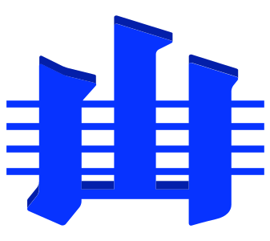

# ICS Supermodel

This repository contains the Semantic Web data and some documentation for the ICS' Supermodel.

The main entrypoint for information about this Supermodel is:

* <https://stratigraphy.org/supermodel>

## Copyright & License

This data is copyrighted as follows:

&copy; International Commission on Stratigraphy, 2026

This data is licensed for use with the Creative Commons Attribution 4.0 license:

* <https://creativecommons.org/licenses/by/4.0/>

A local copy of the license deed is stored in the file LICENSE in this repository.

## Contact

Please contact the executive of the International Commission on Stratigraphy with all questions via <https://stratigraphy.org/executive>.

You may also log any issues with the Supermodel at <https://github.com/i-c-stratigraphy/supermodel/issues>.

