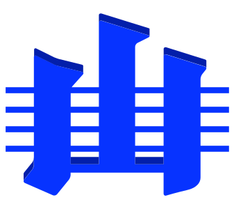

# ICS Supermodel

This repository contains the Semantic Web data and some documentation for the ICS' Supermodel.

The main entrypoint for information about this Supermodel is:

* <https://stratigraphy.org/supermodel>

## Data Structure

The data in this repostory is structured according to the [KGM tool](https://kurrawong.github.io/kgm/) which is used to
validate resources, add labels and syncronise files here with RDF databases.

All resources are linked to by a manifest file - `resources/manifest.ttl` - which indicates what validators, if known, 
can be used to check the conformance of groups of resources to models and what roles resources play.

## Data Delivery

This data is syncrhonised to an RDF database using `kgm`, as above, and then the [Prez](https://prez.dev) tool is used 
to publish it online.

## Copyright & License

This data is copyrighted as follows:

&copy; International Commission on Stratigraphy, 2026

This data is licensed for use with the Creative Commons Attribution 4.0 license:

* <https://creativecommons.org/licenses/by/4.0/>

A local copy of the license deed is stored in the file LICENSE in this repository.

## Contact

Please contact the executive of the International Commission on Stratigraphy with all questions via <https://stratigraphy.org/executive>.

You may also log any issues with the Supermodel at <https://github.com/i-c-stratigraphy/supermodel/issues>.

